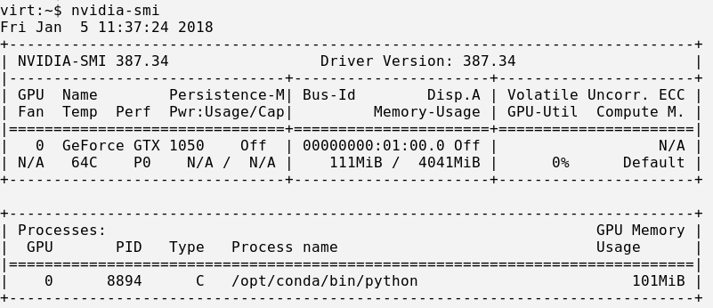

### MLOPS on Fedora Laptop Setup (minikube, kubeflow, GPU enabled laptop)

Fedora, GPU enabled laptop and love OpenShift/Kubernetes.
I wanted to try out `Kubeflow` as well as running `Jupyter` notebooks and `Tensorflow` running on the laptop.

```
http://blog.kubernetes.io/2017/12/introducing-kubeflow-composable.html
https://blog.openshift.com/machine-learning-openshift-kubernetes/
```

#### Laptop Specs

##### Hardware

```
Dell XPS 15
Intel(R) Core(TM) i7-7700HQ CPU @ 2.80GHz
MemTotal:       32787132 kB
Built-in Video Card: 00:02.0 VGA compatible controller: Intel Corporation Device 591b (rev 04)
GPU: 01:00.0 3D controller: NVIDIA Corporation GP107M [GeForce GTX 1050 Mobile] (rev a1)
```

##### OS

UEFI dual boot (Windows 10 / Fedora Core 27), running FC27

```
Linux virt 4.14.8-300.fc27.x86_64 #1 SMP Wed Dec 20 19:00:18 UTC 2017 x86_64 x86_64 x86_64 GNU/Linux
Fedora release 27 (Twenty Seven)
```

#### Graphics setup and GRUB

Using the built-in intel video card with FC27. The Nvidia graphics card being used for MLOPS only (not using for graphics, one day perhaps ...)

The trick to making the intel card work OOTB is to set UEFI acpi up in grub to look like 'windows 2009', then 4k display and external work fine.

The `pci=noaer` gets rid of AE errors spamming dmesg all the time.

The `modprobe.blacklist=nouveau` was added by nvidia driver install (later) but is not required OOTB to work.

Running an LUKS encrypted root partition.


```
cat /etc/default/grub

GRUB_TIMEOUT=5
GRUB_DISTRIBUTOR="$(sed 's, release .*$,,g' /etc/system-release)"
GRUB_DEFAULT=saved
GRUB_DISABLE_SUBMENU=true
GRUB_TERMINAL_OUTPUT="console"
GRUB_CMDLINE_LINUX="modprobe.blacklist=nouveau rd.lvm.lv=fedora_virt/root rd.luks.uuid=luks-8e069228-0ad5-497f-b9f5-17993c4b56e8 rd.lvm.lv=fedora_virt/swap acpi_osi=! \"acpi_osi=Windows 2009\" rhgb quiet pci=noaer"
GRUB_DISABLE_RECOVERY="true"
```

To make changes permanent for grub2 and UEFI:

```
grub2-mkconfig -o /boot/efi/EFI/fedora/grub.cfg
```

I'm using Wayland quite happily (X also works - sometimes needed for applications not Wayland HIDPI friendly)

```
loginctl show-session 2 -p Type
Type=wayland
```

### Wayland / X11 tricks

The joys of a 4K screen is that not all software works ok with it properly, nor with Wayland. Some workarounds i use.

I use this for `intellij`

```
export GDK_BACKEND=x11
```

And i use this handy scaler script under 'X' for `SOAP-UI`

```
dnf install xpra python-xvfbwrapper.noarch xorg-x11-server-Xvfb.x86_64
https://github.com/kaueraal/run_scaled
```

### OPTIMUS/PRIME/Bumblebee

Joys, this is why Linus calls NVIDIA `“the single worst company”` ... 

Anyway, i don't need my GPU for display graphics ;) Although, if i was a gamer - Bumblebee and `optirun` seemed to do most things. I ended up removing Bumblebee (see later for MLOPS work) as `optirun` command not easy to incorporate into various container images that i did not control plus it always caused minor version clashes with CUDA and NVIDIA libraries from the other repos.

Further reading:

```
https://fedoraproject.org/wiki/Bumblebee
http://www.thelinuxrain.com/articles/the-state-of-nvidia-optimus-on-linux
https://wiki.archlinux.org/index.php/PRIME
```

### Install CUDA and NVIDIA drivers

You can use `NVIDIA` rpms:

```
https://developer.download.nvidia.com/compute/cuda/9.0/Prod/docs/sidebar/CUDA_Quick_Start_Guide.pdf
```

and/or

RPMS from `negativo17.org`

```
https://negativo17.org/nvidia-driver/
dnf config-manager --add-repo=https://negativo17.org/repos/fedora-nvidia.repo
dnf install --nogpgcheck http://download1.rpmfusion.org/free/fedora/rpmfusion-free-release-$(rpm -E %fedora).noarch.rpm

dnf install cuda-cudnn.x86_64 cuda-cudnn-devel.x86_64 nvidia-driver-cuda-libs.x86_64 nvidia-driver-libs nvidia-driver kernel-devel dkms-nvidia
```

There is also Fedora Wiki help here if you get stuck:

```
https://fedoraproject.org/wiki/Cuda#Install_NVIDIA_libraries
```

Using the NVIDIA driver i installed the 9-0 cuda runtime and toolkit (the latest is 9-1) however this was too new for `python3 tensorflow` examples (later). But should be ok to uprgrade when those get fixed:

```
-- Browse here to get the repo rpm to install
-- https://developer.nvidia.com/cuda-downloads?target_os=Linux&target_arch=x86_64&target_distro=Fedora&target_version=25&target_type=rpmnetwork
rpm -i ~cuda-repo-fedora25-9.1.85-1.x86_64.rpm

dnf -y install cuda cuda-toolkit-9-0

```

I am using mostly negativo libraries, and found the following to be reproducible. This can be frought with minor cuda, nvidia dependecy version hell of course, but hey.

```
-- enable both the repos above

-- NVIDIA CUDA
-- https://developer.nvidia.com/cuda-downloads?target_os=Linux&target_arch=x86_64&target_distro=Fedora&target_version=25&target_type=rpmnetwork
rpm -i ~cuda-repo-fedora25-9.1.85-1.x86_64.rpm

-- negativo and rpmfusion free
dnf config-manager --add-repo=https://negativo17.org/repos/fedora-nvidia.repo
dnf install --nogpgcheck http://download1.rpmfusion.org/free/fedora/rpmfusion-free-release-$(rpm -E %fedora).noarch.rpm

-- uninstall all cuda and nvidia drivers and reboot to get clean kernel
dnf erase \*cuda\* \*nvidia\*
reboot

-- type the following which will install dependent libraries from both repos  (nvidia-smi is from nvidia-driver-cuda rpm)
nvidia-smi

-- reinstall cuda and toolkit
rpm -i ~mike/Downloads/cuda-repo-fedora25-9.1.85-1.x86_64.rpm
-- // NOTE latest is 9-1 but this wont work with tflow python3
dnf -y install cuda cuda-toolkit-9-0

-- reinstall cuda-cudnn for python and tflow from 
dnf install cuda-cudnn.x86_64 cuda-cudnn-devel.x86_64

-- for posterity, here is my running system

 dnf erase \*cuda\*
Dependencies resolved.
=================================================================================================
 Package                         Arch       Version                     Repository          Size
=================================================================================================
Removing:
 cuda                            x86_64     1:9.1.85-2.fc27             @fedora-nvidia      40 M
 cuda-command-line-tools-9-0     x86_64     9.0.176-1                   @cuda               60 M
 cuda-core-9-0                   x86_64     9.0.176-1                   @cuda               54 M
 cuda-cublas-9-0                 x86_64     9.0.176-1                   @cuda               51 M
 cuda-cublas-dev-9-0             x86_64     9.0.176-1                   @cuda              124 M
 cuda-cudart-9-0                 x86_64     9.0.176-1                   @cuda              468 k
 cuda-cudart-dev-9-0             x86_64     9.0.176-1                   @cuda              4.1 M
 cuda-cudnn                      x86_64     1:7.0.5.15-1.fc27           @fedora-nvidia     269 M
 cuda-cudnn-devel                x86_64     1:7.0.5.15-1.fc27           @fedora-nvidia     274 M
 cuda-cufft-9-0                  x86_64     9.0.176-1                   @cuda              127 M
 cuda-cufft-dev-9-0              x86_64     9.0.176-1                   @cuda              131 M
 cuda-curand-9-0                 x86_64     9.0.176-1                   @cuda               56 M
 cuda-curand-dev-9-0             x86_64     9.0.176-1                   @cuda              122 M
 cuda-cusolver-9-0               x86_64     9.0.176-1                   @cuda               74 M
 cuda-cusolver-dev-9-0           x86_64     9.0.176-1                   @cuda               34 M
 cuda-cusparse-9-0               x86_64     9.0.176-1                   @cuda               53 M
 cuda-cusparse-dev-9-0           x86_64     9.0.176-1                   @cuda              115 M
 cuda-documentation-9-0          x86_64     9.0.176-1                   @cuda              203 M
 cuda-driver-dev-9-0             x86_64     9.0.176-1                   @cuda               41 k
 cuda-libraries-dev-9-0          x86_64     9.0.176-1                   @cuda                0  
 cuda-libs                       x86_64     1:9.1.85-2.fc27             @fedora-nvidia      28 M
 cuda-license-9-0                x86_64     9.0.176-1                   @cuda               80 k
 cuda-misc-headers-9-0           x86_64     9.0.176-1                   @cuda               11 M
 cuda-npp-9-0                    x86_64     9.0.176-1                   @cuda              136 M
 cuda-npp-dev-9-0                x86_64     9.0.176-1                   @cuda              166 M
 cuda-nvgraph-9-0                x86_64     9.0.176-1                   @cuda               22 M
 cuda-nvgraph-dev-9-0            x86_64     9.0.176-1                   @cuda               52 M
 cuda-nvml-dev-9-0               x86_64     9.0.176-1                   @cuda              331 k
 cuda-nvrtc-9-0                  x86_64     9.0.176-1                   @cuda               25 M
 cuda-nvrtc-dev-9-0              x86_64     9.0.176-1                   @cuda               25 k
 cuda-repo-fedora25              x86_64     9.1.85-1                    @System            210  
 cuda-samples-9-0                x86_64     9.0.176-1                   @cuda              209 M
 cuda-toolkit-9-0                x86_64     9.0.176-1                   @cuda                0  
 cuda-visual-tools-9-0           x86_64     9.0.176-1                   @cuda              418 M
 nvidia-driver-cuda              x86_64     2:387.34-1.fc27             @fedora-nvidia     865 k
 nvidia-driver-cuda-libs         x86_64     2:387.34-1.fc27             @fedora-nvidia      88 M
Removing dependent packages:
 libSM-devel                     x86_64     1.2.2-7.fc27                @fedora             19 k
 libXdamage-devel                x86_64     1.1.4-11.fc27               @fedora            2.5 k
 libXext-devel                   x86_64     1.3.3-7.fc27                @fedora             99 k
 libXfixes-devel                 x86_64     5.0.3-4.fc27                @fedora            9.0 k
 libXi-devel                     x86_64     1.7.9-4.fc27                @fedora            126 k
 libXmu-devel                    x86_64     1.1.2-7.fc27                @fedora             66 k
 libXt-devel                     x86_64     1.1.5-6.fc27                @fedora            1.6 M
 libXxf86vm-devel                x86_64     1.1.4-6.fc27                @fedora             12 k
 libglvnd-devel                  x86_64     1:1.0.0-1.fc27              @updates             0  
 libxcb-devel                    x86_64     1.12-5.fc27                 @fedora            2.6 M
 mesa-libGL-devel                x86_64     17.2.4-2.fc27               @updates           1.5 M
 mesa-libGLU-devel               x86_64     9.0.0-13.fc27               @fedora             20 k
 nvidia-persistenced             x86_64     2:387.34-1.fc27             @fedora-nvidia      68 k
Removing unused dependencies:
 freeglut-devel                  x86_64     3.0.0-6.fc27                @fedora            112 k
 gcc-c++                         x86_64     7.2.1-2.fc27                @fedora             26 M
 gl-manpages                     noarch     1.1-14.20161227.fc27        @fedora            1.0 M
 libICE-devel                    x86_64     1.0.9-11.fc27               @fedora            262 k
 libX11-devel                    x86_64     1.6.5-4.fc27                @fedora            1.0 M
 libXau-devel                    x86_64     1.0.8-9.fc27                @fedora            6.4 k
 libdrm-devel                    x86_64     2.4.89-1.fc27               @updates           491 k
 libglvnd-core-devel             x86_64     1:1.0.0-1.fc27              @updates            40 k
 nvidia-driver-NVML              x86_64     2:387.34-1.fc27             @fedora-nvidia     1.3 M
 xorg-x11-proto-devel            noarch     7.7-23.fc27                 @fedora            1.4 M

Transaction Summary
=================================================================================================
Remove  59 Packages

Freed space: 2.9 G
Is this ok [y/N]: Operation aborted.

virt:~$ dnf erase \*nvidia\*
Dependencies resolved.
=================================================================================================
 Package                      Arch   Version                     Repository                 Size
=================================================================================================
Removing:
 akmod-nvidia                 x86_64 2:387.34-1.fc27             @fedora-nvidia             15 M
 kmod-nvidia-4.14.8-300.fc27.x86_64
                              x86_64 2:387.34-1.fc27             @@commandline             7.3 M
 libnvidia-container-tools    x86_64 1.0.0-0.1.alpha.2           @libnvidia-container       31 k
 libnvidia-container1         x86_64 1.0.0-0.1.alpha.2           @libnvidia-container      141 k
 nvidia-container-runtime     x86_64 1.1.1-1.docker17.12.0       @nvidia-container-runtime  12 M
 nvidia-docker2               noarch 2.0.2-1.docker17.12.0.ce    @nvidia-docker            2.3 k
 nvidia-driver                x86_64 2:387.34-1.fc27             @fedora-nvidia             23 M
 nvidia-driver-NVML           x86_64 2:387.34-1.fc27             @fedora-nvidia            1.3 M
 nvidia-driver-cuda           x86_64 2:387.34-1.fc27             @fedora-nvidia            865 k
 nvidia-driver-cuda-libs      x86_64 2:387.34-1.fc27             @fedora-nvidia             88 M
 nvidia-driver-libs           x86_64 2:387.34-1.fc27             @fedora-nvidia             61 M
 nvidia-persistenced          x86_64 2:387.34-1.fc27             @fedora-nvidia             68 k
Removing dependent packages:
 cuda                         x86_64 1:9.1.85-2.fc27             @fedora-nvidia             40 M
 cuda-cudnn-devel             x86_64 1:7.0.5.15-1.fc27           @fedora-nvidia            274 M
 cuda-libs                    x86_64 1:9.1.85-2.fc27             @fedora-nvidia             28 M
 redhat-rpm-config            noarch 67-2.fc27                   @updates                   98 k
 rpm-build                    x86_64 4.14.0-2.fc27               @fedora                   275 k
 rpmdevtools                  noarch 8.10-3.fc27                 @fedora                   200 k
Removing unused dependencies:
 akmods                       noarch 0.5.6-10.fc27               @fedora                    31 k
 dwz                          x86_64 0.12-5.fc27                 @fedora                   216 k
 egl-wayland                  x86_64 1.0.2-0.4.20170802git1f4b1fd.fc27
                                                                 @fedora                    45 k
 elfutils-libelf-devel        x86_64 0.170-1.fc27                @fedora                    32 k
 fakeroot                     x86_64 1.22-1.fc27                 @fedora                   188 k
 fakeroot-libs                x86_64 1.22-1.fc27                 @fedora                   107 k
 fedora-rpm-macros            noarch 26-3.fc27                   @fedora                    79  
 fpc-srpm-macros              noarch 1.1-3.fc27                  @fedora                   134  
 ghc-srpm-macros              noarch 1.4.2-6.fc27                @fedora                   414  
 gnat-srpm-macros             noarch 4-4.fc27                    @fedora                   841  
 go-srpm-macros               noarch 2-10.fc27                   @fedora                   798  
 kmodtool                     noarch 1-25.fc27                   @fedora                    13 k
 libva-vdpau-driver           x86_64 0.7.4-19.fc27               @fedora                   122 k
 ocaml-srpm-macros            noarch 5-2.fc27                    @fedora                   737  
 openblas-srpm-macros         noarch 2-2.fc27                    @fedora                   104  
 perl-srpm-macros             noarch 1-24.fc27                   @fedora                   794  
 python-srpm-macros           noarch 3-23.fc27                   @updates                  2.2 k
 qt5-srpm-macros              noarch 5.9.1-2.fc27                @fedora                   492  
 rust-srpm-macros             noarch 4-3.fc27                    @fedora                   1.1 k
 vulkan-filesystem            noarch 1.0.61.1-1.fc27             @fedora                     0  
 xemacs-filesystem            noarch 21.5.34-25.20170628hg97140cfdeca7.fc27
                                                                 @fedora                     0  
 zlib-devel                   x86_64 1.2.11-4.fc27               @fedora                   143 k
 zstd                         x86_64 1.3.3-1.fc27                @updates                  1.1 M

Transaction Summary
=================================================================================================
Remove  41 Packages


virt:$ cat /etc/ld.so.conf.d/cuda-9-0.conf 
/usr/local/cuda-9.0/targets/x86_64-linux/lib
```

`Note:` I keep all my rpm dependecies cached locally so i don't have to wait and use deltarpm, disk is cheap:

```
cat /etc/dnf/dnf.conf 
[main]
gpgcheck=1
installonly_limit=3
clean_requirements_on_remove=True
deltarpm=1
keepcache=1
```

### Docker and NVIDIA Docker

#### Docker

I tried both fedora 27 `docker` and `docker-latest` from the fedora repos - both suffered issues when trying to run GPU enabled images (`cgroup2` and/or `selinux` mount type problems). Supposedly, these are fixed in rawhide, but i don't want to go there, too unstable for day to day usage. If the issues get fixed i will go back to fedora docker at some point in time.

Showstopper Bugs for me:

```
https://bugzilla.redhat.com/show_bug.cgi?id=1517120
https://bugzilla.redhat.com/show_bug.cgi?id=1411286
```

So, for now i have gone `docker-ce` from Docker:

```
dnf remove docker \
                    docker-common \
                    docker-selinux \
                    docker-engine-selinux \
                    docker-engine

dnf -y install dnf-plugins-core
dnf config-manager \
    --add-repo \
    https://download.docker.com/linux/fedora/docker-ce.repo

dnf install docker-ce
systemctl start docker
```

The default Runtime is `oci`, this is fine ... we change that in the next step to `nvidia`.

`Note`: with the advent of kube 1.8/1.9 and nvidia docker is not required as you can use the docker driver plugin - however its pretty handy for running normal docker images on the GPU outside of kube!

And `docker info`

```
docker info
Containers: 49
 Running: 0
 Paused: 0
 Stopped: 49
Images: 18
Server Version: 17.12.0-ce
Storage Driver: overlay2
 Backing Filesystem: extfs
 Supports d_type: true
 Native Overlay Diff: true
Logging Driver: json-file
Cgroup Driver: cgroupfs
Plugins:
 Volume: local
 Network: bridge host macvlan null overlay
 Log: awslogs fluentd gcplogs gelf journald json-file logentries splunk syslog
Swarm: inactive
Runtimes: nvidia runc
Default Runtime: nvidia
Init Binary: docker-init
containerd version: 89623f28b87a6004d4b785663257362d1658a729
runc version: b2567b37d7b75eb4cf325b77297b140ea686ce8f-dirty (expected: b2567b37d7b75eb4cf325b77297b140ea686ce8f)
init version: 949e6fa
Security Options:
 seccomp
  Profile: default
Kernel Version: 4.14.8-300.fc27.x86_64
Operating System: Fedora 27 (Workstation Edition)
OSType: linux
Architecture: x86_64
CPUs: 8
Total Memory: 31.27GiB
Name: virt
ID: 765S:CWQI:LYAC:EZZJ:JWVB:R5JX:5D6P:R524:SWD4:HJG6:AQ7P:NHBV
Docker Root Dir: /var/lib/docker
Debug Mode (client): false
Debug Mode (server): false
Registry: https://index.docker.io/v1/
Labels:
Experimental: false
Insecure Registries:
 127.0.0.0/8
Live Restore Enabled: false
```

#### NVIDIA Docker

Install `nvidia-docker2` from here:

```
https://github.com/NVIDIA/nvidia-docker
```

You need to check that your NVIDIA card is not a legacy one here:

```
http://www.nvidia.com/object/IO_32667.html
```

Otherwise you will need to install legacy NVIDIA drivers (i did not need to do this)

Using the `centos7` repo for fedora.

```
curl -s -L https://nvidia.github.io/nvidia-docker/centos7/x86_64/nvidia-docker.repo | \
  sudo tee /etc/yum.repos.d/nvidia-docker.repo
dnf install -y nvidia-docker2
```

You need to adjust the `daemon.json` to make `nvidia` the default driver.

```
-- vi /etc/docker/daemon.json 
{
    "default-runtime": "nvidia",
    "runtimes": {
        "nvidia": {
            "path": "/usr/bin/nvidia-container-runtime",
            "runtimeArgs": []
        }
    }
}

systemctl restart docker
```
#### Tests

You can test CUDA and NVIDIA drivers are working in a container using the nvidia/cuda image - the docker run commands should all be equivalent now:

```
docker run --runtime=nvidia --rm nvidia/cuda nvidia-smi
OR
nvidia-docker --rm nvidia/cuda nvidia-smi
OR
docker run --rm nvidia/cuda nvidia-smi


Fri Jan  5 04:59:38 2018       
+-----------------------------------------------------------------------------+
| NVIDIA-SMI 387.34                 Driver Version: 387.34                    |
|-------------------------------+----------------------+----------------------+
| GPU  Name        Persistence-M| Bus-Id        Disp.A | Volatile Uncorr. ECC |
| Fan  Temp  Perf  Pwr:Usage/Cap|         Memory-Usage | GPU-Util  Compute M. |
|===============================+======================+======================|
|   0  GeForce GTX 1050    Off  | 00000000:01:00.0 Off |                  N/A |
| N/A   50C    P0    N/A /  N/A |      0MiB /  4041MiB |      0%      Default |
+-------------------------------+----------------------+----------------------+
                                                                               
+-----------------------------------------------------------------------------+
| Processes:                                                       GPU Memory |
|  GPU       PID   Type   Process name                             Usage      |
|=============================================================================|
|  No running processes found                                                 |
+-----------------------------------------------------------------------------+

```

As a second test, try the Google Tensorflow GPU image to see if it can recognise the GPU:

```
docker run --runtime=nvidia -it gcr.io/tensorflow/tensorflow:latest-gpu /bin/bash

root@7f6bb1c02ad2:/notebooks# python
Python 2.7.12 (default, Nov 20 2017, 18:23:56) 
[GCC 5.4.0 20160609] on linux2
Type "help", "copyright", "credits" or "license" for more information.
>>> import tensorflow as tf
>>> tf.test.gpu_device_name()
2018-01-05 05:06:28.361487: I tensorflow/core/platform/cpu_feature_guard.cc:137] Your CPU supports instructions that this TensorFlow binary was not compiled to use: SSE4.1 SSE4.2 AVX AVX2 FMA
2018-01-05 05:06:28.667148: I tensorflow/stream_executor/cuda/cuda_gpu_executor.cc:892] successful NUMA node read from SysFS had negative value (-1), but there must be at least one NUMA node, so returning NUMA node zero
2018-01-05 05:06:28.667504: I tensorflow/core/common_runtime/gpu/gpu_device.cc:1030] Found device 0 with properties: 
name: GeForce GTX 1050 major: 6 minor: 1 memoryClockRate(GHz): 1.493
pciBusID: 0000:01:00.0
totalMemory: 3.95GiB freeMemory: 3.90GiB
2018-01-05 05:06:28.667549: I tensorflow/core/common_runtime/gpu/gpu_device.cc:1120] Creating TensorFlow device (/device:GPU:0) -> (device: 0, name: GeForce GTX 1050, pci bus id: 0000:01:00.0, compute capability: 6.1)
'/device:GPU:0'
>>> 
```

`Note:` The `nvidia-smi` command should also work from CLI.

`Note:` When reverting back to fedora docker (controlled by systemd), you need move the `daemon.json` script aside else you will not be able to start docker and will get errors as documented here [https://docs.docker.com/engine/admin/#troubleshoot-conflicts-between-the-daemonjson-and-startup-scripts]. Add the nvidia runtime argument to systemd control script. I wish Lennart Pottering and Solomon Hykes would kiss and make up. This is not required for docker-ce which uses daemon.json

Systemd docker.service script changes:

```
-- vi /etc/systemd/system/multi-user.target.wants/docker.service

ExecStart=/usr/bin/dockerd-current \
          --add-runtime oci=/usr/libexec/docker/docker-runc-current \
          --add-runtime nvidia=/usr/bin/nvidia-container-runtime
          --default-runtime=nvidia \

systemctl daemon-reload
systemctl restart docker
```

### Python3 and Tensorflow Locally

Check we can run `python3` and  `tensorflow` lilbraries ok locally first.

A prerequisite for tensorflow python are the Intel ML libraries:

```
git clone https://github.com/01org/mkl-dnn.git
cd mkl-dnn/scripts && ./prepare_mkl.sh && cd ..
mkdir -p build && cd build && cmake .. && make
sudo make install
```

We need a newer tensorflow wheel for CUDA 9-0 (default is 8-0 currently)

```
pip3 install --user mike --ignore-installed --upgrade \ https://github.com/mind/wheels/releases/download/tf1.4-gpu-cuda9/tensorflow-1.4.0-cp36-cp36m-linux_x86_64.whl
pip3 show tensorflow-gpu
```

Check it works:

```
python3
>>> import tensorflow as tf
>>> hello=tf.constant('Hello, TensorFlow!')
>>> sess = tf.Session()
>>> print(sess.run(hello))
b'Hello TensforFlow!'
```

Who could forget the `Not hotdog` episode in `Silicon Valley` [https://www.youtube.com/watch?v=ACmydtFDTGs]

```
git clone https://github.com/tensorflow/tensorflow.git 
git clone https://github.com/tensorflow/models.git
cd models/tutorials/image/imagenet
python3 classify_image.py
python3 classify_image.py --image_file='/home/mike/Pictures/hotdog2.jpg'
```


Classification:

```
virt:~/git/models/tutorials/image/imagenet$ python3 classify_image.py --image_file='/home/mike/Pictures/hotdog2.jpg'
2018-01-04 20:20:04.326753: I tensorflow/stream_executor/cuda/cuda_gpu_executor.cc:892] successful NUMA node read from SysFS had negative value (-1), but there must be at least one NUMA node, so returning NUMA node zero
2018-01-04 20:20:04.327011: I tensorflow/core/common_runtime/gpu/gpu_device.cc:1030] Found device 0 with properties: 
name: GeForce GTX 1050 major: 6 minor: 1 memoryClockRate(GHz): 1.493
pciBusID: 0000:01:00.0
totalMemory: 3.95GiB freeMemory: 3.90GiB
2018-01-04 20:20:04.327028: I tensorflow/core/common_runtime/gpu/gpu_device.cc:1120] Creating TensorFlow device (/device:GPU:0) -> (device: 0, name: GeForce GTX 1050, pci bus id: 0000:01:00.0, compute capability: 6.1)
2018-01-04 20:20:04.875421: W tensorflow/core/framework/op_def_util.cc:334] Op BatchNormWithGlobalNormalization is deprecated. It will cease to work in GraphDef version 9. Use tf.nn.batch_normalization().
hotdog, hot dog, red hot (score = 0.99403)
Pekinese, Pekingese, Peke (score = 0.00034)
CD player (score = 0.00012)
Christmas stocking (score = 0.00010)
gar, garfish, garpike, billfish, Lepisosteus osseus (score = 0.00009)
```

Try `jupyter notebook` and the madelbrot example running natively:

```
pip3 install --user mike jupyter
pip3 install --user mike notebook
pip3 install --user mike --upgrade ipykernel

jupyter notebook

-- follow the example here
https://www.tensorflow.org/tutorials/mandelbrot
```

You should get something like this:


### Minikube install

```
https://github.com/kubernetes/minikube
```

Openshift origin is not quite at 1.8/1.9 yet - so, opting for `minikube` running locally (no VM or passthrough for PCI devices) which has better GPU support.

Prerequisite install `kubectl`

```
curl -LO https://storage.googleapis.com/kubernetes-release/release/$(curl -s https://storage.googleapis.com/kubernetes-release/release/stable.txt)/bin/linux/amd64/kubectl
--curl -LO https://storage.googleapis.com/kubernetes-release/release/v1.9.0/bin/linux/amd64/kubectl
chmod +x ./kubectl
sudo mv ./kubectl /usr/local/bin/kubectl
```

Install `minikube`

```
curl -Lo minikube https://storage.googleapis.com/minikube/releases/latest/minikube-linux-amd64 && chmod +x minikube && sudo mv minikube /usr/local/bin/
```

`Note:` i disabled the automatic starting of minikube which is part of install

```
systemctl disable localkube.service
```


On fedora, `selinux` and `firewalld` get in the way. 

We also need to enable GPU support (this changes from 1.7 alpha to Device Plugins in 1.8/1.9 kube) - See:

```
https://kubernetes.io/docs/tasks/manage-gpus/scheduling-gpus/
https://github.com/NVIDIA/k8s-device-plugin
```

Run:

```
systemctl stop firewalld
setenforce 0
minikube start --cpus=3 --memory=8000 --vm-driver=none --feature-gates=DevicePlugins=true
```

Check its running and open the dashboard:

```
minikube status
minikube dashboard
```

Run the NVIDIA device plugin for kube

```
kubectl create -f https://raw.githubusercontent.com/NVIDIA/k8s-device-plugin/v1.8/nvidia-device-plugin.yml
```

You should see log output if OK

```
kubectl logs nvidia-device-plugin-daemonset-znz2m

2018/01/05 02:25:23 Loading NVML
2018/01/05 02:25:23 Fetching devices.
2018/01/05 02:25:23 Starting FS watcher.
2018/01/05 02:25:23 Starting OS watcher.
2018/01/05 02:25:23 Starting to serve on /var/lib/kubelet/device-plugins/nvidia.sock
2018/01/05 02:25:23 Registered device plugin with Kubelet
```

Some Useful commands:

```
https://kubernetes.io/docs/reference/kubectl/cheatsheet/

journalctl -f -u localkube
kubectl get po --all-namespaces
```

`Note`: When you run `Fedora docker` it runs under a different cgroup to `kubernetes/minikube`, which you only dicover here. This can be solved by running kubelet with `--extra-config=kubelet.CgroupDriver=systemd` argument. Not required for docker-ce that we are running for now.

`Note:` for port forwarding on minikube you may also need to install `socat`:

```
dnf install socat
```

### Kubeflow install

```
http://blog.kubernetes.io/2017/12/introducing-kubeflow-composable.html
```

A prerequisite is `ksonnet` from Heptio. Links:

```
https://github.com/ksonnet/ksonnet
https://github.com/ksonnet/ksonnet/tree/master/docs/cli-reference#command-line-reference
https://github.com/ksonnet/ksonnet/releases
https://github.com/ksonnet/ksonnet/blob/master/docs/concepts.md#component
```

Create a namespace rather than use default:

```
kubectl create -f - << EOF
apiVersion: v1
kind: Namespace
metadata:
  name: mlops
EOF
```

Start kubeflow project:

```
ks init my-kubeflow
cd my-kubeflow
```

Initialize our ksonnet application and install the Kubeflow packages

```
ks registry add kubeflow \
  github.com/google/kubeflow/tree/master/kubeflow
ks pkg install kubeflow/core
ks pkg install kubeflow/tf-serving
ks pkg install kubeflow/tf-job
ks generate core kubeflow-core --name=kubeflow-core --namespace mlops
```

`Note:` set env variable `export GITHUB_TOKEN=<token>` if you get rate limit errors from github.

Set a kube context utilizing a specific username and namespace

```
kubectl config view
kubectl config set-context minikube --user=minikube --namespace=mlops \
  && kubectl config use-context minikube
kubectl config use-context minikube
```

Define environments corresponding to our cluster

```
ks env add minikube
```

Deploy
- JupyterHub for launching and managing Jupyter notebooks on K8s 
- A TF CRD

```
ks apply minikube -c kubeflow-core -n mlops
```

Wait and check all pods are running

```
kubectl get all
```

Connect to `Jupyter Hub` (we could also get ingress working)

```
kubectl port-forward tf-hub-0 8100:8000
http://127.0.0.1:8100/hub/login
```

Spawn a GPU enabled noteook using a random username (gpu in this case):

```
user: gpu
image: gcr.io/kubeflow/tensorflow-notebook-gpu

```

Repeat the Madlebot example from local run before, but this time using container.

You can see running process on the GPU using:

```
nvidia-smi
OR
nvidia-smi pmon
```




You can also submit a training job by first generating a new job from a prototype using ksonnet:

```
ks generate tf-cnn cnn --name=cnn --namespace mlops
-- set prams for gpu
ks param set --env=minikube cnn num_gpus 1
ks param set --env=minikube cnn num_workers 1
-- apply
ks apply minikube -c cnn -n mlops
```

You will note why we need more than one GPU ;) A limitation of kube currently:

```
-- worker does not run because of limitation here:
-- https://kubernetes.io/docs/tasks/manage-gpus/scheduling-gpus/
-- Containers (and pods) do not share GPUs. There’s no overcommitting of GPUs.
```

#### Training a model and serving it up using

